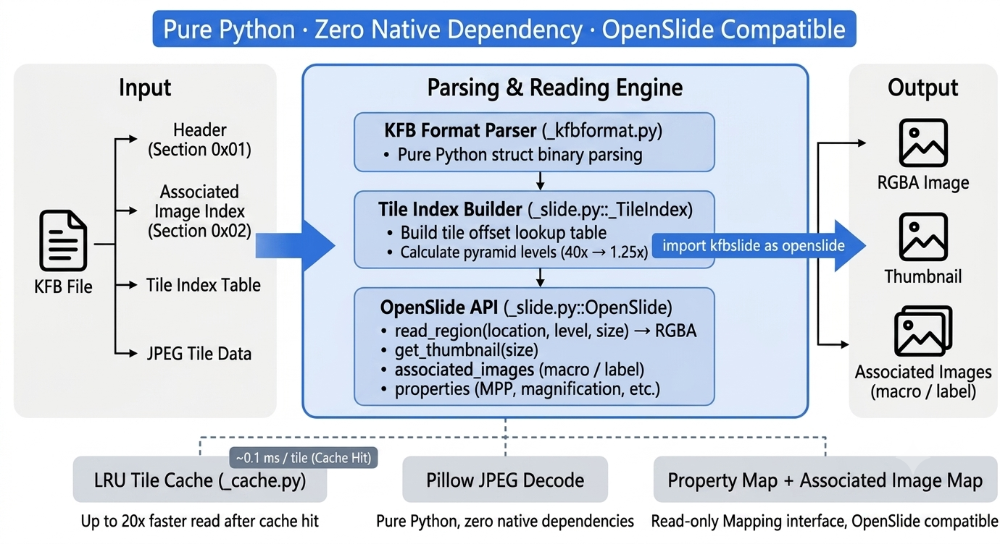

<h1 align="center">KFBSlide</h1>

<p align="center">
  <strong>A pure-Python KFB (KFBio) whole-slide image reader with an OpenSlide-compatible API</strong>
</p>

<p align="center">
  <a href="README.md">English</a> |
  <a href="README_zh.md">简体中文</a>
</p>

<p align="center">
  <a href="https://pypi.org/project/kfbslide"></a>
  <a href="https://pypi.org/project/kfbslide"></a>
  <a href="https://github.com/yifanfeng97/kfbslide/blob/main/LICENSE"></a>
  <a href="https://pypi.org/project/kfbslide"></a>
  <a href="https://github.com/yifanfeng97/kfbslide"></a>
</p>

<p align="center">
  <a href="#-features">✨ Features</a> •
  <a href="#-installation">📦 Installation</a> •
  <a href="#-quick-start">🚀 Quick Start</a> •
  <a href="#-api-reference">📖 API</a> •
  <a href="#-performance">⚡ Performance</a>
</p>

<p align="center">
  
</p>

---

## ✨ Features

- 🐍 **Pure Python** — Zero native dependencies, works out of the box on Windows / macOS / Linux
- 🔄 **OpenSlide-Compatible API** — Drop-in replacement for `openslide-python`, no code changes needed
- 🔺 **Multi-Level Pyramids** — Automatically parses 40× / 20× / 10× / 5× / 2.5× / 1.25× levels inside KFB
- 🖼️ **Associated Images** — Supports macro, label, and thumbnail
- ⚡ **Tile LRU Cache** — 10~20× speedup for repeated reads of the same region
- 📊 **Full Metadata** — MPP, objective power, tile size, and more

---

## 📦 Installation

### Using uv (recommended)

```bash
uv pip install kfbslide
```

### Using pip

```bash
pip install kfbslide
```

Only depends on Pillow — installs directly on any platform.

---

## 🚀 Quick Start

### Drop-in replacement for OpenSlide

```python
import kfbslide as openslide

slide = openslide.OpenSlide("path/to/sample.kfb")

print(f"Levels: {slide.level_count}")
print(f"Level 0 dimensions: {slide.dimensions}")
for i in range(slide.level_count):
    print(f"  Level {i}: {slide.level_dimensions[i]} "
          f"downsample={slide.level_downsamples[i]}")

# Read a region (location in level-0 coordinates, returns RGBA)
img = slide.read_region((1000, 2000), 0, (256, 256))
img.save("region.png")

# Thumbnail
thumb = slide.get_thumbnail((512, 512))
thumb.save("thumbnail.png")

# Associated images
macro = slide.associated_images["macro"]
macro.save("macro.png")

# Property access
vendor = slide.properties[openslide.PROPERTY_NAME_VENDOR]
mpp_x = slide.properties[openslide.PROPERTY_NAME_MPP_X]

slide.close()
```

### Context manager

```python
with openslide.OpenSlide("sample.kfb") as slide:
    img = slide.read_region((0, 0), 0, (256, 256))
# Automatically closed
```

---

## 📖 API Reference

### `OpenSlide(filename)`

Open a KFB file.

### Class methods

| Method | Description |
|--------|-------------|
| `OpenSlide.detect_format(filename)` | Detect file format, returns `"kfbio"` or `None` |

### Properties

| Property | Type | Description |
|----------|------|-------------|
| `level_count` | `int` | Number of pyramid levels |
| `dimensions` | `(int, int)` | Level 0 dimensions (highest resolution) |
| `level_dimensions` | `Tuple[(w, h), ...]` | Dimensions of each level |
| `level_downsamples` | `Tuple[float, ...]` | Downsample factor for each level |
| `properties` | `Mapping[str, str]` | Metadata properties (read-only mapping) |
| `associated_images` | `Mapping[str, PIL.Image]` | Associated images: macro, label, thumbnail |
| `color_profile` | `object \| None` | ICC color profile (currently returns `None`) |

### Methods

| Method | Description |
|--------|-------------|
| `read_region(location, level, size)` | Read a region, returns **RGBA** image |
| `get_best_level_for_downsample(downsample)` | Pick the best pyramid level for a given downsample factor |
| `get_thumbnail(size)` | Generate a thumbnail |
| `set_cache(cache)` | API-compatible no-op |
| `close()` | Close and release resources |

### Property constants

```python
from kfbslide import (
    PROPERTY_NAME_VENDOR,           # "openslide.vendor"
    PROPERTY_NAME_MPP_X,            # "openslide.mpp-x"
    PROPERTY_NAME_MPP_Y,            # "openslide.mpp-y"
    PROPERTY_NAME_OBJECTIVE_POWER,  # "openslide.objective-power"
)
```

---

## ⚡ Performance

Benchmarked on `sample.kfb` (71,748 × 56,282, 82,595 tiles):

| Operation | Time | Note |
|-----------|------|------|
| First read of 256×256 region | ~2.1 ms | Pillow backend |
| Cache-hit read | **~0.10 ms** | 22× faster |
| Scan 20 adjacent regions (first time) | ~33 ms | 1.6 ms/region |
| Scan 20 adjacent regions (cached) | **~2.2 ms** | 0.11 ms/region, 15× faster |

> Test environment: Python 3.12, Pillow, SSD.

---

## 🏗️ Architecture

<p align="center">
  
</p>

KFBSlide is implemented entirely in pure Python, reading images by directly parsing the KFB binary format:

- **No C/C++ extensions or system dynamic libraries required**
- **No dependency on OpenSlide, libtiff, libjpeg, or other external libraries**
- **Single-file deployable, suitable for servers, containers, and embedded environments**

---

## 📁 Project Structure

```
kfbslide/
├── src/kfbslide/
│   ├── __init__.py          # Package entry point, exports OpenSlide API
│   ├── _slide.py            # OpenSlide main class
│   ├── _kfbformat.py        # KFB binary format parser
│   ├── _cache.py            # LRU tile cache
│   └── _exceptions.py       # OpenSlideError / compatibility exceptions
├── tests/                   # Tests (includes sample.kfb symlink)
├── examples/                # Example scripts
├── docs/                    # Documentation images
├── README.md
├── LICENSE
└── pyproject.toml
```

---

## ⚠️ Known Limitations

1. **Read-only**: Writing to KFB files is not currently supported.
2. **KFB v1.6**: Verified on version 1.6 files. Other versions may require adaptation.
3. **JPEG decoding**: Uses Pillow for JPEG decoding, consistent across all platforms.

---

## 📄 License

[MIT](LICENSE)

Copyright (c) 2026 Yifan Feng
