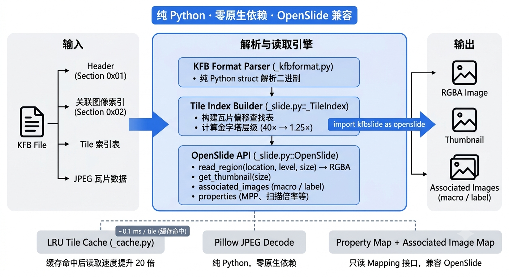

<h1 align="center">KFBSlide</h1>

<p align="center">
  <strong>纯 Python 实现的 KFB（KFBio）数字病理切片读取库，提供与 OpenSlide 完全兼容的 API</strong>
</p>

<p align="center">
  <a href="README.md">English</a> |
  <a href="README_zh.md">简体中文</a>
</p>

<p align="center">
  <a href="https://pypi.org/project/kfbslide"></a>
  <a href="https://pypi.org/project/kfbslide"></a>
  <a href="https://github.com/yifanfeng97/kfbslide/blob/main/LICENSE"></a>
  <a href="https://pypi.org/project/kfbslide"></a>
  <a href="https://github.com/yifanfeng97/kfbslide"></a>
</p>

<p align="center">
  <a href="#-特性">✨ 特性</a> •
  <a href="#-安装">📦 安装</a> •
  <a href="#-快速开始">🚀 快速开始</a> •
  <a href="#-api-参考">📖 API</a> •
  <a href="#-性能">⚡ 性能</a>
</p>

<p align="center">
  
</p>

---

## ✨ 特性

- 🐍 **纯 Python 实现** — 零原生依赖，跨平台开箱即用
- 🔄 **OpenSlide 兼容 API** — 可直接替换 `openslide-python`，无需修改业务代码
- 🔺 **金字塔多层级读取** — 自动解析 KFB 内部 40× / 20× / 10× / 5× / 2.5× / 1.25× 层级
- 🖼️ **关联图像读取** — 支持 macro、label、thumbnail
- ⚡ **Tile LRU 缓存** — 重复读取同区域加速 10~20 倍
- 📊 **完整元数据支持** — MPP、扫描倍率、瓦片尺寸等

---

## 📦 安装

### 使用 uv（推荐）

```bash
uv pip install kfbslide
```

### 使用 pip

```bash
pip install kfbslide
```

仅依赖 Pillow，任何平台都能直接安装。

---

## 🚀 快速开始

### 作为 OpenSlide 的 drop-in 替代品

```python
import kfbslide as openslide

slide = openslide.OpenSlide("path/to/sample.kfb")

print(f"层级数: {slide.level_count}")
print(f"Level 0 尺寸: {slide.dimensions}")
for i in range(slide.level_count):
    print(f"  Level {i}: {slide.level_dimensions[i]} "
          f"downsample={slide.level_downsamples[i]}")

# 读取区域（location 为 level 0 坐标，返回 RGBA）
img = slide.read_region((1000, 2000), 0, (256, 256))
img.save("region.png")

# 缩略图
thumb = slide.get_thumbnail((512, 512))
thumb.save("thumbnail.png")

# 关联图像
macro = slide.associated_images["macro"]
macro.save("macro.png")

# 属性读取
vendor = slide.properties[openslide.PROPERTY_NAME_VENDOR]
mpp_x = slide.properties[openslide.PROPERTY_NAME_MPP_X]

slide.close()
```

### 上下文管理器

```python
with openslide.OpenSlide("sample.kfb") as slide:
    img = slide.read_region((0, 0), 0, (256, 256))
# 自动 close
```

---

## 📖 API 参考

### `OpenSlide(filename)`

打开一个 KFB 文件。

### 类方法

| 方法 | 说明 |
|------|------|
| `OpenSlide.detect_format(filename)` | 检测文件格式，返回 `"kfbio"` 或 `None` |

### 属性

| 属性 | 类型 | 说明 |
|------|------|------|
| `level_count` | `int` | 金字塔层级数 |
| `dimensions` | `(int, int)` | Level 0 尺寸（最高分辨率） |
| `level_dimensions` | `Tuple[(w, h), ...]` | 每层尺寸 |
| `level_downsamples` | `Tuple[float, ...]` | 每层下采样倍数 |
| `properties` | `Mapping[str, str]` | 元数据属性（只读映射） |
| `associated_images` | `Mapping[str, PIL.Image]` | 关联图像：macro、label、thumbnail |
| `color_profile` | `object \| None` | ICC 颜色配置文件（当前返回 `None`） |

### 方法

| 方法 | 说明 |
|------|------|
| `read_region(location, level, size)` | 读取指定区域，返回 **RGBA** 图像 |
| `get_best_level_for_downsample(downsample)` | 根据下采样倍数选择最佳层级 |
| `get_thumbnail(size)` | 生成缩略图 |
| `set_cache(cache)` | API 兼容方法（当前为 no-op） |
| `close()` | 关闭并释放资源 |

### 属性常量

```python
from kfbslide import (
    PROPERTY_NAME_VENDOR,           # "openslide.vendor"
    PROPERTY_NAME_MPP_X,            # "openslide.mpp-x"
    PROPERTY_NAME_MPP_Y,            # "openslide.mpp-y"
    PROPERTY_NAME_OBJECTIVE_POWER,  # "openslide.objective-power"
)
```

---

## ⚡ 性能

在 `sample.kfb`（71,748 × 56,282，82,595 tiles）上测试：

| 操作 | 时间 | 备注 |
|------|------|------|
| 首次读取 256×256 region | ~2.1 ms | Pillow 后端 |
| 缓存命中读取 | **~0.10 ms** | 22× 加速 |
| 扫描 20 个相邻 region（首次） | ~33 ms | 1.6 ms/region |
| 扫描 20 个相邻 region（缓存后） | **~2.2 ms** | 0.11 ms/region，15× 加速 |

> 测试环境：Python 3.12，Pillow，SSD。

---

## 🏗️ 架构

<p align="center">
  
</p>

KFBSlide 完全基于纯 Python 实现，通过直接解析 KFB 二进制格式完成图像读取：

- **无需任何 C/C++ 扩展或系统动态库**
- **不依赖 OpenSlide、libtiff、libjpeg 等外部库**
- **单文件即可部署，适合服务器、容器、嵌入式等场景**

---

## 📁 项目结构

```
kfbslide/
├── src/kfbslide/
│   ├── __init__.py          # 包入口，导出 OpenSlide API
│   ├── _slide.py            # OpenSlide 主类
│   ├── _kfbformat.py        # KFB 二进制格式解析
│   ├── _cache.py            # LRU tile 缓存
│   └── _exceptions.py       # OpenSlideError / 兼容异常
├── tests/                   # 测试（含 sample.kfb 软链）
├── examples/                # 示例脚本
├── docs/                    # 文档图片
├── README.md
├── LICENSE
└── pyproject.toml
```

---

## ⚠️ 已知限制

1. **只读**：目前不支持写入 KFB 文件。
2. **KFB v1.6**：在版本 1.6 文件上验证过。其他版本可能需要适配。
3. **JPEG 解码**：使用 Pillow 进行 JPEG 解码，跨平台一致。

---

## 📄 License

[MIT](LICENSE)

Copyright (c) 2026 Yifan Feng
